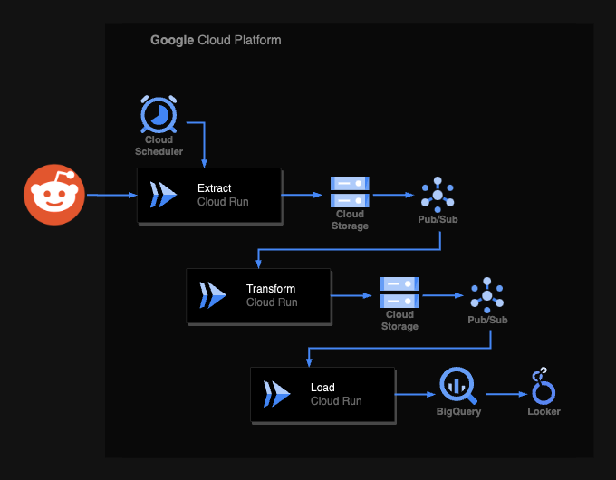

# University Subreddits

The r/nus subreddit is a *peculiar* place. Most people think it is toxic and predominantly negative. It got me thinking — how does r/nus stack up against other university subreddits around the world?

This dashboard uses language algorithms to gauge the sentiment of posts, and aggregates the daily upvote ratio of each university's subreddit. Feel free to use it to compare your university to any rival institutions you so desire.

Interestingly, this project also yields a world ranking of universities based on online student satisfaction — a happiness ranking. I'll leave it's interpretation as an exercise to the reader.

# Architecture

All infrastructure is hosted on Google Cloud Platform and managed via Terraform.

- Idempotent ETL scripts are Python 3.11 docker containers running on Cloud Run. Backfilling can be triggered by sending requests to the extract container.

- Cloud Storage for the raw and transformed data.

- BigQuery for the analytics database.

- Cloud Scheduler to trigger **extract** at set intervals.

- Pub/Sub to trigger **transform**/**load** upon ingestion of raw/transformed data respectively.
